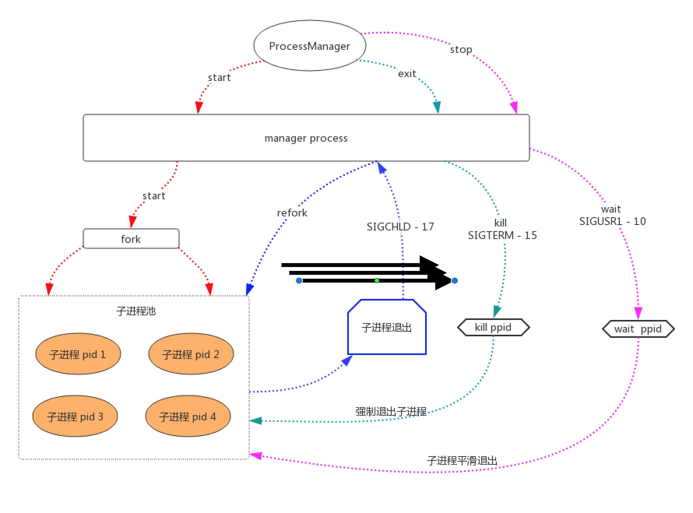

# processManager 


* 基于swoole的脚本管理，用于多进程和守护进程管理；
* 可轻松让普通脚本变守护进程和多进程执行；
* 进程个数可配置，可以根据配置一次性执行多条命令；
* 子进程异常退出时,主进程收到信号，自动拉起重新执行；
* 支持子进程平滑退出，防止重启服务对业务造成影响；
* 子进程重启次数max_request 到达请求次数自动销毁
* 子进程内存控制memory_limit，某daemon下进程达到内存上线，自动销毁，拉起新进程
* 配置文件可以按照模块进行分组操作，一个配置文件可起多个消费任务
* 第三方业务框架扩展，可通过配置文件指定业务代码的加载方式，并可以在业务代码前加载钩子来执行第三方框架需要的函数、类包等
* 对每个服务增加了CPU保护措施（防止开发人员不写sleep这样会导致CPU占用过高），在底层增加了一个微妙级别的usleep控制。


## 1. 场景

* PHP脚本需要跑一个或多个脚本消费队列/计算等任务
* 实现脚本退出后自动拉起，防止消费队列不工作，影响业务
* 其实supervisor可以轻松做个事情，这个只是PHP的另一种实现，不需要换技术栈

## 2. 流程图



## 3. 安装
* https://github.com/zl8762385/ProcessManager.git
* composer install
* 根据自己业务配置,修改task/serviceConf.php


## 4. 配置实例
* 一次性执行多个命令
```
    'exec'      => [
        [
            'name' => 'member_1',// 名称即使文件名，请慎用
            'max_request' => 0, // 限制进程最大请求数 0=不限制请求书  >0超出销毁
            'memory_limit' => 50, // 单位:MB 最大内存限制，超出将自动销毁重新启动
            'workNum'   => 2
        ],
    ],
```
## 5. 运行

### 5.1 启动
* chmod -R u+r log/
* php processmanager -s start -c serviceConf.php
### 5.2 平滑停止服务，根据子进程执行时间等待所有服务停止
* php processmanager -s stop -c serviceConf.php
### 5.3 强制停止服务[慎用]
* php processmanager -s exit -c serviceConf.php
### 5.4 强制重启
* php processmanager -s restart -c serviceConf.php
### 5.5 监控
* ps -ef|grep 'process'

### 5.6 启动参数说明
```
NAME
      php processmanager - manage processmanager 

SYNOPSIS
      php processmanager -s command [options] -c config file path
          Manage processmanager daemons.


WORKFLOWS


      help [command]
      Show this help, or workflow help for command.

      -s restart
      Stop, then start processmanager master and workers.

      -s start 
      Start processmanager master and workers.
      -s start -c ./config
      Start processmanager with specail config file.


      -s stop
      Wait all running workers smooth exit, please check processmanager status for a while.

      -s exit
      Kill all running workers and master PIDs.

```

## 9. 感谢

* [swoole](http://www.swoole.com/)


